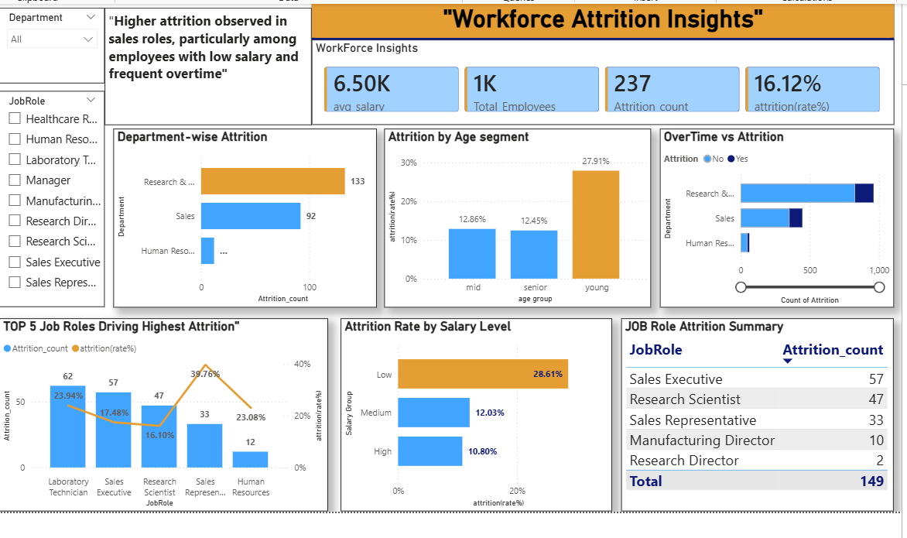

# HR-Attrition-Analysis
HR Attrition Analysis

📌 Project Overview
This project analyzes employee attrition data to identify the key factors influencing employee turnover.

📊 Dataset
- Total records: ~1500 employees
- Includes details like age, department, salary, job role

🛠 Tools Used
- SQL
- Excel
- Power BI

🔍 Process
- Cleaned and prepared dataset
- Performed analysis using SQL queries
- Built interactive dashboard in Power BI

📈 Key Insights

- Higher attrition observed in Sales department
- Employees with lower salary show higher attrition
- Certain job roles have higher turnover rates
  
💡 Recommendations
- Reduce overtime workload in critical roles
- Improve compensation for low salary employees
- Focus on retention strategies in sales departments

📅 Project Duration 
Feb 2026 – Mar 2026

📊 Dashboard Preview

